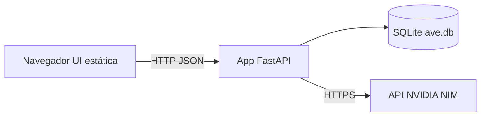

# ave

Chatbot de **tutoria em química** desenvolvido no contexto de disciplina acadêmica de Inteligência Artificial I: backend em **FastAPI**, persistência em **SQLite** (conversas e mensagens) e **interface web** em página única que consome a API de *chat completions* do [NVIDIA NIM](https://build.nvidia.com/) (modelo Mistral *instruct*). O assistente responde em **português** e mantém o foco em tópicos de química.

---

## Índice

- [Funcionalidades](#funcionalidades)
- [Arquitetura](#arquitetura)
- [Requisitos](#requisitos)
- [Início rápido](#início-rápido)
- [Configuração](#configuração)
- [Executando a aplicação](#executando-a-aplicação)
- [Referência da API](#referência-da-api)
- [Interface web](#interface-web)
- [Armazenamento de dados](#armazenamento-de-dados)
- [Estrutura do projeto](#estrutura-do-projeto)
- [Solução de problemas](#solução-de-problemas)
- [Licença](#licença)

---

## Funcionalidades

- Interface de chat com renderização Markdown (via CDN do [marked](https://github.com/markedjs/marked)).
- Lista de conversas (“Histórico”) persistida no SQLite.
- Fluxo de nova conversa com IDs gerados no cliente (`crypto.randomUUID()`).
- Visualização somente leitura de conversas antigas pela barra lateral.
- Janela recente de mensagens enviada ao LLM no servidor (em memória; ver [Arquitetura](#arquitetura)).

---

## Arquitetura



1. O navegador carrega `GET /` (arquivo `static/index.html`).
2. `POST /` envia a mensagem do usuário e o `conversation_id`; a API grava as mensagens e chama o modelo.
3. O histórico usa `GET /historico` e `GET /conversations/{id}/messages`.

**Contexto do LLM:** as últimas interações ficam em uma lista no módulo `services/llm.py` (compartilhada entre todas as requisições). Para um demo de usuário único costuma ser suficiente; o contexto **não** fica isolado por `conversation_id` no payload enviado ao modelo.

---

## Requisitos

- **Python 3.10+** (recomendado; compatível com as versões atuais de FastAPI/Pydantic).
- Uma **chave de API da NVIDIA** com acesso ao endpoint integrado usado no código (`integrate.api.nvidia.com`).

---

## Início rápido

### 1. Entrar na pasta do projeto

```bash
cd chatbot
```

### 2. Criar e ativar um ambiente virtual

```bash
python3 -m venv venv
source venv/bin/activate   # Linux / macOS
# venv\Scripts\activate    # Windows
```

### 3. Instalar dependências

```bash
pip install -r requirements.txt
```

### 4. Variáveis de ambiente

Crie um arquivo `.env` na **raiz do projeto** (mesmo diretório que `main.py`). Esse arquivo está no **`.gitignore`** — não commite segredos.

```env
NVIDIA_API_KEY=sua_chave_nvidia_aqui
```

Obtenha a chave na documentação para desenvolvedores / NIM, conforme sua conta NVIDIA.

---

## Configuração

| Variável           | Obrigatória | Descrição                                              |
|--------------------|-------------|--------------------------------------------------------|
| `NVIDIA_API_KEY`   | Sim         | Token *Bearer* para a API de chat integrada NVIDIA.    |

O `python-dotenv` carrega o `.env` automaticamente quando `core/config` é importado.

---

## Executando a aplicação

Inicie o **Uvicorn a partir da raiz do repositório** para que `StaticFiles(directory="static")` resolva os caminhos corretamente:

```bash
uvicorn main:app --reload --host 0.0.0.0 --port 8000
```

Em seguida abra **http://127.0.0.1:8000/** no navegador.

- **Documentação OpenAPI (Swagger):** http://127.0.0.1:8000/docs  
- **ReDoc:** http://127.0.0.1:8000/redoc  

---

## Referência da API

URL base (local padrão): `http://127.0.0.1:8000`

### `GET /`

Retorna a página **HTML** do chat (`static/index.html`).

---

### `POST /`

Envia uma mensagem de chat para uma conversa.

**Corpo da requisição** (`application/json`):

| Campo              | Tipo   | Descrição                                      |
|--------------------|--------|------------------------------------------------|
| `message`          | string | Texto da mensagem do usuário.                  |
| `conversation_id`  | string | UUID ou identificador estável do tópico.       |

**Resposta de sucesso** (`200`, JSON):

```json
{
  "error": false,
  "response": "Resposta do assistente em português."
}
```

**Resposta de erro** (`200` com flag de erro, JSON):

```json
{
  "error": true,
  "message": "Erro legível (ex.: tempo esgotado, erro HTTP)."
}
```

A mensagem do usuário é sempre salva; a resposta do assistente só é salva quando `error` é `false`.

---

### `GET /historico`

Lista as conversas, da mais recente para a mais antiga.

**Resposta:** array JSON de objetos:

```json
[
  {
    "id": "string-uuid",
    "last_message": "Prévia do texto…",
    "updated_at": "data/hora no estilo SQLite"
  }
]
```

---

### `GET /conversations/{conversation_id}/messages`

Mensagens de uma conversa, da mais antiga para a mais recente.

**Resposta:** array JSON:

```json
[
  {
    "role": "user",
    "content": "…",
    "created_at": "…"
  }
]
```

---

## Interface web

- Arquivos estáticos são servidos em **`/static`** (útil se você adicionar CSS/JS em `static/`).
- A interface embutida chama a API em **`http://127.0.0.1:8000`**. Se mudar host ou porta, atualize as URLs do `fetch` em `static/index.html` ou use **URLs relativas** (por exemplo `fetch("/", { method: "POST", ... })`) para que a origem acompanhe a página.

---

## Armazenamento de dados

- **Arquivo do banco:** `db/ave.db` (criado na primeira subida do servidor via `init_db()`).
- **Tabelas:**
  - `conversations` — `id`, prévia em `last_message`, datas.
  - `messages` — `conversation_id`, `role`, `content`, `created_at`.

O diretório `db/` é garantido na importação; `ave.db` está no `.gitignore` para não versionar dados locais.

---

## Estrutura do projeto

```
chatbot/
├── main.py              # App FastAPI, CORS, estáticos, init do BD na subida
├── requirements.txt
├── .env                 # só na sua máquina — você cria; não vai pro git
├── core/
│   ├── config.py        # ambiente / NVIDIA_API_KEY
│   └── text_utils.py    # utilitários de prévia de texto
├── db/
│   ├── database.py      # SQLite, esquema, helpers de persistência
│   └── ave.db           # gerado em tempo de execução (gitignored)
├── models/
│   └── schemas.py       # modelos Pydantic de requisição
├── routes/
│   └── chat.py          # rotas HTTP: UI, chat, histórico
├── services/
│   └── llm.py           # cliente NVIDIA + histórico em memória
└── static/
    └── index.html       # UI do chat (marked.js via CDN)
```

---

## Solução de problemas

| Sintoma | O que verificar |
|---------|-----------------|
| `Bearer None` ou 401 da NVIDIA | `NVIDIA_API_KEY` definida no `.env`; reinicie o servidor após editar. |
| 404 em `/static/...` ou UI quebrada | Execute o Uvicorn na **raiz do repositório**, não em subpasta. |
| UI abre mas o `fetch` falha | Porta/host diferentes: a UI assume `127.0.0.1:8000` — alinhe com o Uvicorn ou use `fetch` com URLs relativas. |
| Erro de banco na primeira execução | Permissão para criar/gravar `db/ave.db` (disco, permissões de pasta). |

---

## Licença

Indique aqui a licença do projeto (por exemplo MIT) ou, se for apenas trabalho acadêmico, algo como “Todos os direitos reservados”.
