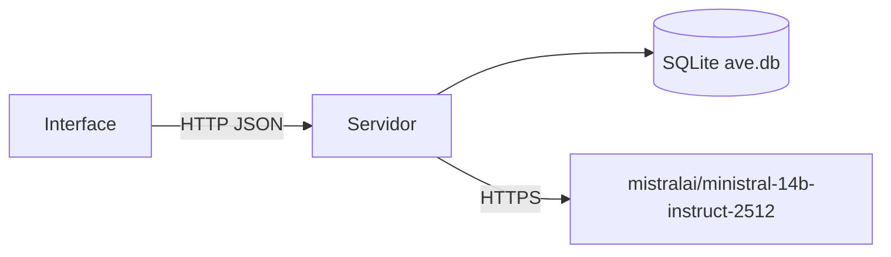

# ave

Chatbot de **tutoria em química** desenvolvido no contexto de disciplina acadêmica de Inteligência Artificial I: backend em **FastAPI**, persistência em **SQLite** (conversas e mensagens) e **interface web** em página única que consome a API do modelo [ministral-14b-instruct-2512](https://build.nvidia.com/mistralai/ministral-14b-instruct-2512). O assistente responde em **português** e mantém o foco em tópicos de química.

---

## Índice

- [Funcionalidades](#funcionalidades)
- [Arquitetura](#arquitetura)
- [Requisitos](#requisitos)
- [Início rápido](#início-rápido)
- [Executando a aplicação](#executando-a-aplicação)
- [Referência da API](#referência-da-api)
- [Interface web](#interface-web)
- [Armazenamento de dados](#armazenamento-de-dados)
- [Estrutura do projeto](#estrutura-do-projeto)
- [Limitações](#limitações) 

---

## Funcionalidades

- Interface de chat com renderização Markdown (via CDN do [marked](https://github.com/markedjs/marked)).
- Lista de conversas (“Histórico”) persistida no SQLite.
- Fluxo de nova conversa com IDs gerados no cliente (`crypto.randomUUID()`).
- Visualização de conversas antigas pela sidebar.
- Janela recente de mensagens enviada ao LLM no servidor (em memória).

---

## Arquitetura



1. O navegador carrega `GET /` (arquivo `static/index.html`).
2. `POST /` envia a mensagem do usuário e o `conversation_id`; a API grava as mensagens e chama o modelo.
3. O histórico usa `GET /historico` e `GET /conversations/{id}/messages`.

---

## Requisitos

- **Python 3.10+** (recomendado; compatível com as versões atuais de FastAPI/Pydantic).
- Uma **chave de API da NVIDIA** com acesso ao modelo ministral-14b-instruct-2512.

---

## Início rápido

### 1. Clonar o repositório 

```bash
git clone https://github.com/seu-usuario/ave.git
cd ave
```

### 2. Criar e ativar um ambiente virtual

```bash
python3 -m venv venv
source venv/bin/activate   # Linux / macOS
# venv\Scripts\activate    # Windows
```

### 3. Instalar dependências

```bash
pip install -r requirements.txt
```

### 4. Variáveis de ambiente

Crie um arquivo `.env` na **raiz do projeto** (mesmo diretório que `main.py`).

```env
NVIDIA_API_KEY=sua_chave_nvidia_aqui
```

Obtenha a chave na documentação para desenvolvedores / NIM, conforme sua conta NVIDIA.

---

## Executando a aplicação

Inicie o **Uvicorn a partir da raiz do repositório** para que `StaticFiles(directory="static")` resolva os caminhos corretamente:

```bash
uvicorn main:app --reload --host 0.0.0.0 --port 8000
```

Em seguida abra **http://127.0.0.1:8000/** no navegador.

---

## Referência da API

URL base (local padrão): `http://127.0.0.1:8000`

### `GET /`

Retorna a página **HTML** do chat (`static/index.html`).

---

### `POST /`

Envia uma mensagem de chat para uma conversa.

**Corpo da requisição** (`application/json`):

| Campo              | Tipo   | Descrição                                      |
|--------------------|--------|------------------------------------------------|
| `message`          | string | Texto da mensagem do usuário.                  |
| `conversation_id`  | string | UUID ou identificador estável do tópico.       |

**Resposta de sucesso** (`200`, JSON):

```json
{
  "error": false,
  "response": "Resposta do assistente em português."
}
```

**Resposta de erro** (`200` com flag de erro, JSON):

```json
{
  "error": true,
  "message": "Erro legível (ex.: tempo esgotado, erro HTTP)."
}
```

A mensagem do usuário é sempre salva; a resposta do assistente só é salva quando `error` é `false`.

---

### `GET /historico`

Lista as conversas, da mais recente para a mais antiga.

**Resposta:** array JSON de objetos:

```json
[
  {
    "id": "string-uuid",
    "last_message": "Prévia do texto…",
    "updated_at": "data/hora no estilo SQLite"
  }
]
```

---

### `GET /conversations/{conversation_id}/messages`

Mensagens de uma conversa, da mais antiga para a mais recente.

**Resposta:** array JSON:

```json
[
  {
    "role": "user",
    "content": "…",
    "created_at": "…"
  }
]
```

---

## Interface web

- Arquivos estáticos são servidos em **`/static`**
- A interface embutida chama a API em **`http://127.0.0.1:8000`**. Se mudar host ou porta, atualize as URLs do `fetch` em `static/index.html` ou use **URLs relativas** (por exemplo `fetch("/", { method: "POST", ... })`) para que a origem acompanhe a página.

---

## Armazenamento de dados

- **Arquivo do banco:** `db/ave.db` (criado na primeira subida do servidor via `init_db()`).
- **Tabelas:**
  - `conversations` — `id`, prévia em `last_message`, datas.
  - `messages` — `conversation_id`, `role`, `content`, `created_at`.

---

## Estrutura do projeto

```
ave/
├── main.py              # App FastAPI, CORS, estáticos, init do BD na subida
├── requirements.txt
├── .env                 # só na sua máquina — você cria; não vai pro git
├── core/
│   ├── config.py        # ambiente / NVIDIA_API_KEY
│   └── text_utils.py    # utilitários de prévia de texto
├── db/
│   ├── database.py      # SQLite, esquema, helpers de persistência
│   └── ave.db           # gerado em tempo de execução (gitignored)
├── models/
│   └── schemas.py       # modelos Pydantic de requisição
├── routes/
│   └── chat.py          # rotas HTTP: UI, chat, histórico
├── services/
│   └── llm.py           # cliente NVIDIA + histórico em memória
└── static/
    └── index.html       # UI do chat (marked.js via CDN)
```

## Limitações

- O contexto do modelo é mantido em memória no servidor e não é isolado por `conversation_id`. Como o sistema foi desenvolvido como uma demonstração de uso individual, essa simplificação foi adotada para reduzir a complexidade.
